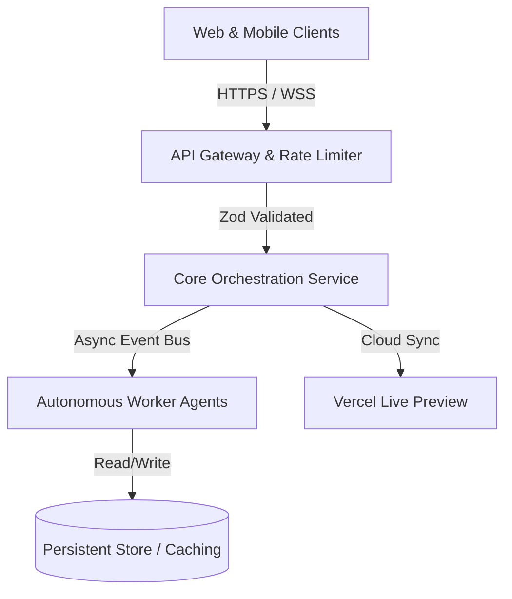

# System Architecture & Topology

**Project**: Build a complete production-grade full-stack web a
**Lead Architect**: Frontend Engineer
**Timestamp**: 2026-10-09T07:10:33.068Z

## Component Topology
1. **Frontend Layer**: Single Page App powered by Vite + React + Tailwind.
2. **Backend API**: Node.js Express microservice with strict OpenAPI endpoints.
3. **Validation & Security**: OWASP security headers, CORS origin verification, and input sanitation.
4. **Verification Gate**: Multi-stage regression tests before live deployment.
